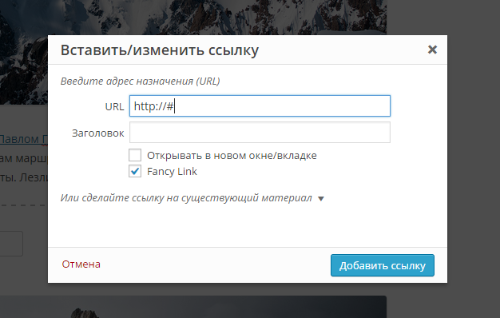

# Fancy Links

This plugin allows you to add class to yuor links in Wordpress Visual Editor.

Compatible with **WordPress v4.0.1**.

## Screenshots

## Installation

1. Download the latest zip file and extract the `fancy-links` directory.
2. Upload it to your `/wp-content/plugins/` directory.
3. Activate `Fancy Links` on the `Plugins` menu in WordPress.
4. Add some code to your theme stylesheet (style.css)

## License

Original Copyright (c) 2014 [Fábio Santos](http://www.fabiosantos.pt). See the LICENSE
file for license rights and limitations (GPLv2).

Overbuild by [Kirill Belotserkovskiy] (http://steelinside.com).
